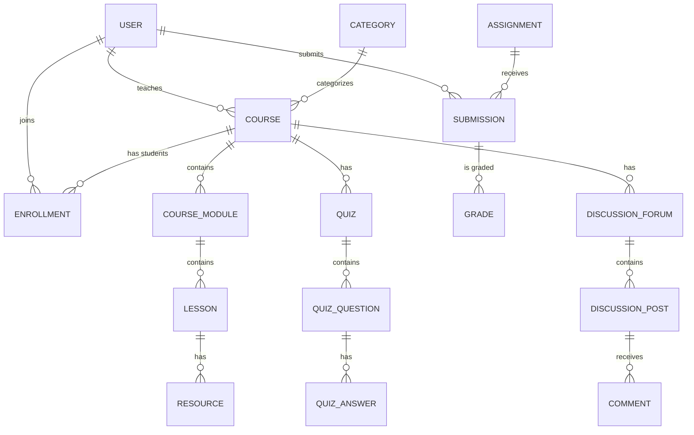

# NexLearn LMS - Backend API

NexLearn adalah Learning Management System (LMS) modern yang dibangun dengan arsitektur yang skalabel, aman, dan modular menggunakan NestJS.

## 🏗️ Arsitektur Sistem

Project ini mengikuti pola **Layered Architecture** dan **Modular Design** dari NestJS:

1.  **Common Layer**: Berisi global utilities seperti `Guards`, `Interceptors`, `Decorators`, dan `Interfaces`.
2.  **Module Layer**: Setiap fitur (Users, Courses, Auth, dll) dipisahkan ke dalam module-nya sendiri yang bersifat independen.
3.  **Data Layer**: Menggunakan TypeORM dengan PostgreSQL untuk manajemen database.

### Request Lifecycle
Setiap request yang masuk melewati tahapan berikut:
`Request` -> `Middleware` -> `Guards (Auth)` -> `Interceptors (Pre-mapping)` -> `Pipes (Validation)` -> `Controller` -> `Service` -> `Interceptor (Post-mapping)` -> `Response`

## 🔐 Keamanan & Akses

Aplikasi ini menggunakan sistem **Secure by Default**:
-   **JWT Authentication**: Semua endpoint terkunci secara default.
-   **Public Access**: Gunakan decorator `@Public()` untuk membuka akses endpoint (misal: Landing Page).
-   **Role-Based Access Control (RBAC)**: Mendukung role `student`, `instructor`, dan `admin`.

## 📊 Relasi Database (Entity Relationship)

Berikut adalah visualisasi bagaimana setiap fitur saling terhubung:



## 🚀 Fitur Utama

### 1. Authentication & Users
-   Registrasi & Login dengan JWT.
-   Manajemen profil user dan upload avatar.
-   Sistem role untuk membatasi akses fitur instruktur vs siswa.

### 2. Course Management
-   Instruktur dapat membuat dan mengelola kursus.
-   Struktur konten yang dalam: **Course > Module > Lesson**.
-   Mendukung resource tambahan (PDF/Link) untuk setiap lesson.

### 3. Enrollment & Learning
-   Siswa dapat mendaftar (enroll) ke kursus.
-   Pelacakan progres belajar.
-   Sistem Top Categories berdasarkan jumlah penjualan (enrollment).

### 4. Evaluation (Quizzes & Assignments)
-   Pembuatan kuis dengan pertanyaan pilihan ganda.
-   Pengumpulan tugas (Assignments).
-   Penilaian otomatis dan manual (Grades).

### 5. Social & Engagement
-   Forum diskusi untuk setiap kursus.
-   Sistem komentar dan notifikasi real-time.
-   Penerbitan sertifikat setelah kursus selesai.

## 📡 Standar Response API

Semua endpoint mengembalikan format JSON yang konsisten:

```json
{
  "message": "Deskripsi aksi yang dilakukan",
  "data": { ... },
  "meta": {
    "totalItems": 100,
    "totalPages": 10,
    "currentPage": 1
  }
}
```

## 🛠️ Cara Menjalankan

1.  Clone repository.
2.  Install dependencies: `yarn install`.
3.  Copy `.env.example` ke `.env` dan sesuaikan konfigurasi database.
4.  Jalankan aplikasi: `yarn start:dev`.
5.  Buka dokumentasi Swagger di: `http://localhost:3000/api/docs`.
